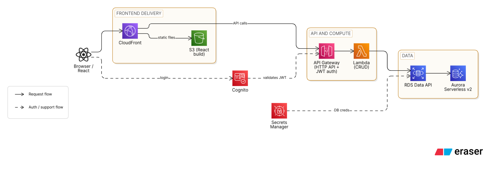

# Contactly — AWS Learning Plan

**Contactly** is a simple contacts app (CRUD + email auth) built as a deliberate first step into the AWS serverless ecosystem.

The goal is to internalize the "AWS way" of building things — infra-as-code, managed auth, serverless compute, cloud-native databases — before tackling more complex projects. Every decision in this project prioritizes learning the core AWS mental model over feature completeness: one resource at a time, deployed and understood before moving to the next.

Contactly is the first of two learning vehicles. The second (**Noted**, a multi-tenant notes app) builds on top of what's learned here and introduces VPC networking, multi-tenancy patterns, and Google OAuth.

---

## The Stack

| Layer | Choice | Role |
|---|---|---|
| Infra | CDK (TypeScript) | Defines every resource as code, `cdk deploy` / `cdk destroy` |
| Frontend | React + TanStack | The UI, built to static files |
| Hosting | S3 + CloudFront | Serves the React build, single entry point |
| API | API Gateway (HTTP API) | HTTP routes, validates Cognito JWTs natively |
| Auth | Cognito | Email sign-up/sign-in, issues JWTs |
| Compute | Lambda (Node.js) | CRUD business logic, scoped per user |
| DB access | RDS Data API | SQL over HTTPS, no VPC, no connection management |
| Database | Aurora Serverless v2 (Postgres) | Stores contacts, scales to near-zero at idle |
| Secrets | Secrets Manager | DB credentials, referenced by Data API calls |

---

## Architecture



### Key architectural decisions

**RDS Data API over VPC + direct connection**
Lambda stays outside any VPC. Each query is a self-contained HTTPS call — AWS manages the actual Postgres connection pool behind the endpoint. No NAT Gateway (~$1/day saved), no connection exhaustion under concurrent Lambda invocations, no VPC complexity.

**HTTP API (API Gateway v2) over REST API (v1)**
HTTP API has a native JWT authorizer — API Gateway validates Cognito tokens automatically with zero custom code. Cheaper and simpler than a Lambda authorizer.

**Aurora Serverless v2 over RDS / DynamoDB**
Relational domain (users, contacts, foreign keys) fits SQL naturally. Serverless v2 scales to near-zero at idle (no fixed hourly cost when not in use). No DynamoDB — access patterns are unknown and will evolve; DynamoDB requires designing those upfront.

**CDK (TypeScript) over SAM / console**
Infra as real code — loops, functions, shared types with Lambda handlers. One `cdk deploy` to create everything, one `cdk destroy` to tear it down cleanly. `RemovalPolicy.DESTROY` on all resources for clean teardown.

---

## Project Structure

```
contactly/
  infra/
    bin/
      app.ts               # CDK entry point
    lib/
      contactly-stack.ts   # All AWS resources defined here
    cdk.json
    tsconfig.json

  backend/
    src/
      handlers/
        contacts.ts        # CRUD Lambda handler
      db/
        client.ts          # Data API wrapper
        migrations/
          001_init.sql     # Schema
      types/
        index.ts           # Shared types

  frontend/
    src/                   # React + TanStack app

  package.json             # Monorepo root
  tsconfig.json
```

---

## Build Phases

Each phase is independently deployable and testable before moving on.

### Phase 0 — Scaffold & bootstrap

**Goal:** Prove the CDK → AWS pipeline works.

- `mkdir infra && cd infra && cdk init app --language typescript`
- Understand generated files: `bin/app.ts` (entry), `lib/*-stack.ts` (resources), `cdk.json` (config)
- `cdk bootstrap` — one-time per account/region, creates S3 bucket + IAM roles CDK needs to operate
- Deploy the empty stack: `cdk deploy`
- Confirm in the AWS console the CloudFormation stack exists

**Concepts learned:** CloudFormation stacks, CDK project structure, bootstrapping.

---

### Phase 1 — Hello world Lambda + API Gateway

**Goal:** See the core serverless request/response loop end to end.

- Add an HTTP API and a single Lambda to the CDK stack
- Route: `GET /health` → Lambda returns `{ "status": "ok" }`
- Deploy, hit the endpoint with `curl`
- Read the CloudWatch logs

**CDK resources:** `aws_apigatewayv2.HttpApi`, `aws_lambda.Function`, `aws_apigatewayv2_integrations.HttpLambdaIntegration`

**Concepts learned:** Lambda execution model, API Gateway routes, IAM execution roles, CloudWatch logs.

---

### Phase 2 — Cognito

**Goal:** Understand auth in isolation before wiring it in.

- Add a Cognito User Pool + App Client to the CDK stack
- Configure email sign-up/sign-in
- Sign up a test user via the AWS CLI
- Exchange credentials for a JWT
- Inspect the JWT (jwt.io) — understand the `sub`, `email`, `iss` claims

**CDK resources:** `aws_cognito.UserPool`, `aws_cognito.UserPoolClient`

**Concepts learned:** Cognito user pools vs identity pools, JWT structure, how claims carry user identity.

---

### Phase 3 — Aurora Serverless v2 + Secrets Manager + Data API

**Goal:** Query Postgres from a Lambda over the Data API.

- Add Aurora Serverless v2 cluster to the CDK stack with `enableHttpEndpoint: true`
- Let CDK auto-generate the master credentials secret in Secrets Manager
- Run the initial migration (`CREATE TABLE users`, `CREATE TABLE contacts`)
- Write a test Lambda that queries the DB via the Data API SDK
- Verify: `curl /db-test` returns rows

> **Note:** Verify RDS Data API is available in `us-east-2` when enabling it. If not, `us-east-1` is the guaranteed fallback — update `cdk.json` region accordingly.

**CDK resources:** `aws_rds.DatabaseCluster`, `aws_secretsmanager.Secret`, Lambda IAM policy for `rds-data:ExecuteStatement` + `secretsmanager:GetSecretValue`

**Concepts learned:** Aurora Serverless v2 scaling, Secrets Manager, Data API query format, least-privilege IAM, `RemovalPolicy.DESTROY`.

---

### Phase 4 — CRUD handlers + JWT auth

**Goal:** A fully working, secured, user-scoped API.

- Add JWT authorizer to API Gateway (points at Cognito user pool)
- Implement Lambda handlers: `POST /contacts`, `GET /contacts`, `PUT /contacts/:id`, `DELETE /contacts/:id`
- Scope all queries to the caller's `sub` claim (passed by API Gateway after JWT validation)
- Test with a real JWT: authenticated requests succeed, unauthenticated return 401

**Concepts learned:** JWT authorizer config, how `sub` scopes data per user, parameterized queries via Data API.

---

### Phase 5 — React frontend

**Goal:** The whole thing, working in a browser.

- Scaffold React app with TanStack Router (routing) + TanStack Query (API calls)
- Integrate Cognito auth (AWS Amplify auth library or oidc-client)
- Build CRUD UI against the real API endpoints
- `npm run build` → upload to S3 → configure CloudFront distribution
- Test end to end: sign up, create a contact, read, update, delete

**CDK resources:** `aws_s3.Bucket`, `aws_cloudfront.Distribution`, `aws_cloudfront_origins.S3BucketOrigin`, `aws_s3_deployment.BucketDeployment`

**Concepts learned:** S3 static hosting, CloudFront origin access control, invalidations on deploy, `RemovalPolicy.DESTROY` on S3 bucket.

---

## Cost Management

| Resource | Cost | Action |
|---|---|---|
| Lambda | Free tier | No action needed |
| API Gateway (HTTP API) | Free tier | No action needed |
| Cognito | Free tier (≤50k MAU) | No action needed |
| S3 + CloudFront | Free tier | No action needed |
| Secrets Manager | ~$0.40/secret/mo | Acceptable |
| Aurora Serverless v2 | ~$0.06/hr at idle | **`cdk destroy` when done for the day** |

**Set a billing alarm before deploying anything:**
AWS Console → Billing → Budgets → $20/month with email alert.

**End of session workflow:**
```bash
cdk destroy   # tears down the entire stack cleanly
```

---

## AWS / CDK Setup Checklist

- [x] AWS account created
- [x] MFA enabled on root user
- [x] IAM user `joan-dev` created with `AdministratorAccess`
- [x] Access keys configured as `[default]` profile in `~/.aws/credentials`
- [x] Region set to `us-east-2` (Ohio)
- [x] `aws sts get-caller-identity` returns `joan-dev` ARN
- [x] Node.js + AWS CDK CLI installed (`npm install -g aws-cdk`)
- [x] `cdk --version` works

---

## Engineering Principles

- **Infra-as-code only** — no resources created manually in the console
- **Least-privilege IAM** — every Lambda gets only the permissions it needs, scoped to specific ARNs
- **No secrets in plaintext** — always Secrets Manager, never environment variables for credentials
- **`RemovalPolicy.DESTROY` on all resources** — `cdk destroy` must work cleanly every time
- **One phase at a time** — deploy and validate before adding the next layer
- **Read CloudWatch logs** — every time something breaks, logs first

---

## What Comes Next (After Contactly)

The second learning vehicle is **Noted** — a multi-tenant notes app that introduces:

- Google OAuth via Cognito identity federation
- Multi-tenant data isolation (tenant-scoped queries, RBAC)
- Lambda-in-VPC + RDS Proxy (the alternative to Data API — real Postgres driver, proper networking)
- VPC, subnets, security groups, NAT Gateway vs VPC endpoints

By the end of both projects, the work streaming platform's AWS architecture will be readable and familiar.
